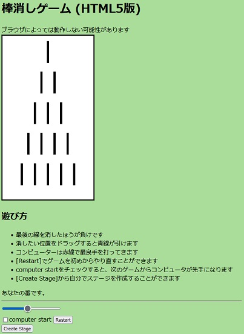

棒消しゲーム
====

ニムゲームの一種、棒消しゲームの必勝プログラムをjavascriptで作りました

## 始め方

### デモのページ

[Demo](http://mession.mydns.jp/~gigaho/bokesi/js_boukeshi/)

### 実行環境

Web browser: Edge (V40 above), Google Chrome (V61 above) or Firefox (V56 above).  

---
### 使い方
####  ZIPのダウンロード:

CodeのDownload ZIPから for_japanese-master.zip をダウンロードします。
ファイルを解凍、展開後、boukeshiホルダの中の index.htm をお使いのWebブラウザで開きます。

デフォルトではユーザが先手になっていますので、消したい場所をドラッグすると青い線で棒を消すことができます。
続いてPCが最善手を使って赤い棒で消してきます。交互にすべての棒が消えるまでゲームを続けます。
最後の棒を消したほうが負けです。

---

### ライセンス

This project is licensed under the [MIT](https://raw.githubusercontent.com/b4b4r07/dotfiles/master/doc/LICENSE-MIT.txt) License

